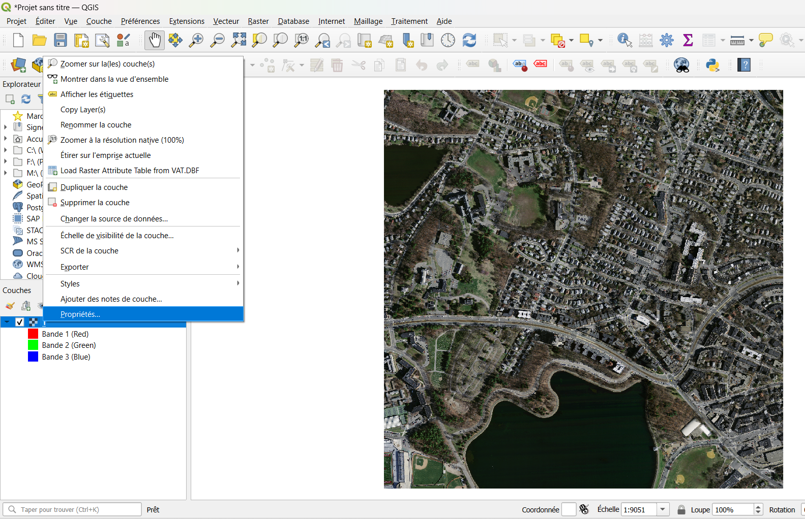
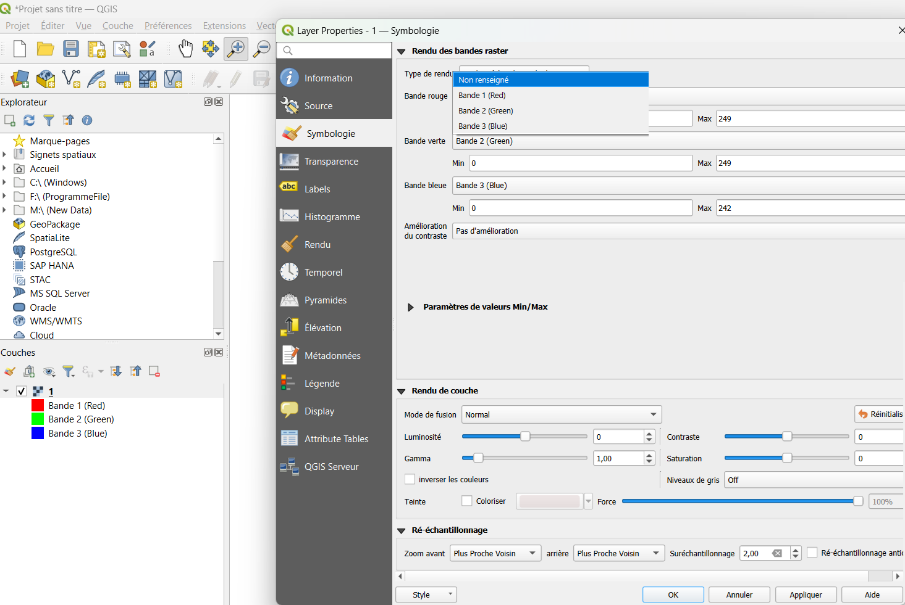
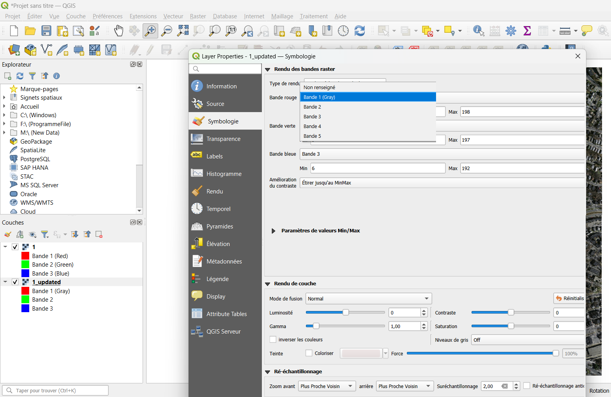

# TriFusionBD – Building Segmentation from GeoTIFF (Test Repository)

> **⚠️ Note:** This repository provides a **quick test harness** for the pretrained **TriFusionBD** model.  
> It is intended for **fast experimentation on small sample GeoTIFFs**.  
> For **full-scale or advanced processing**, please explore the **ArcGIS_Pro_3**, **Google_Earth_Engine**, and **Training_and_Data_Capping** folders.

This repository provides a **lightweight test harness** for the pretrained **TriFusionBD** model to segment **buildings** on updated test images that combine **RGB + DEM + Slope** layers (5 bands).  
The two provided test images (**1.tif** and **2.tif**) are extracted from the **test partition of the Massachusetts Buildings Dataset** and have been extended with DEM and slope channels for evaluation.  

---

## 📦 Requirements

- Python 3.8+
- TensorFlow
- numpy
- rasterio
Install dependencies:

    pip install -r requirements.txt

Create `requirements.txt`:

    tensorflow==2.15.0
    numpy
    rasterio

---

## 📂 Repository Structure

    TriFusionBD-Test/
    │── README.md
    │── TriFusion_Gate_Atrous_Gate.py   # Model definition
    │── predict.py                       # Run inference on all GeoTIFFs in test_dem/
    │── threshold.py                     # Apply threshold to probability maps
    │
    ├── ArcGIS_Pro_3/                        
    │   ├── adding_dem_slope.py
    │   ├── shp_from_mosaic_all.py
    │   └── mosaic.py
    │
    │   
    ├── Google_Earth_Engine                        
    │   └── 2_updated.tif
    │
    │
    ├── Training_and_Data_Capping                        
    │   ├── Test_TriFusion_Gate_Atrous_Gate.py
    │   ├── TriFusion_Gate_Atrous_Gate.py
    │   └── create_csv_files.py
    │
    │
    ├── test_updated/                        # UPDATED test GeoTIFFs (5 bands: R,G,B,DEM,Slope)
    │   ├── 1_updated.tif
    │   └── 2_updated.tif
    │
    └── test/                            # ORIGINAL test GeoTIFFs (reference RGB)
        ├── 1.tif
        └── 2.tif

**Input format**: GeoTIFFs with **5 bands** ordered as **[R, G, B, DEM, Slope]**.

---

## 🚀 Quick Start

### 1) Run Prediction (probability maps)
Runs on **all `.tif` files inside `test_updated/`** and writes per-pixel building probabilities (0–1) to `output/`.

    python predict.py

This creates:

    output/
      ├── 1_updated.tif    # float32, values in [0,1]
      └── 2_updated.tif

**Color meaning (for visualization):**
- 0.0 → **black** (non-building)
- 1.0 → **white** (building)
- (0.0–1.0) → **grayscale** probability

---

### 2) Apply Threshold (binary masks)
Converts probability maps to **binary** masks using a user-defined threshold (e.g., 0.50). The result contains **white (1)** for building and **black (0)** for background.

    python threshold.py --threshold 0.9

This creates:

    output_threshold_0.9/
      ├── updated_1.tif    # uint8 or bool, {0,1}
      └── updated_2.tif

> You can repeat with different thresholds. A new folder named `output_threshold_X.XX/` is created each time.

---

## 🛰️ Visualizing in QGIS
You can use QGIS to inspect both the original and updated test rasters.
Download QGIS (Windows):
    https://download.osgeo.org/qgis/windows/QGIS-OSGeo4W-3.44.2-1.msi?US
1. Open **QGIS**.
2. Drag the files from `output/` (probabilities) or `output_threshold_X.XX/` (binary) into the **Layers** panel in QGIS, **or simply open them with Paint/Image Viewer for a quick check**.
3. Add corresponding originals from `test/` or updated inputs from `test_updated/` for overlay comparison.

Right-click the raster layer and open Properties → Information (Figure 1).

**Figure 1.** Raster properties window  

The original Massachusetts test image contains only 3 bands (RGB) (Figure 2).

**Figure 2.** Original Massachusetts test image (3 bands: RGB)  

The updated test image contains 5 bands (RGB + DEM + Slope) (Figure 3).

**Figure 3.** Updated test image (5 bands: RGB + DEM + Slope)  

This confirms that the updated dataset properly includes the elevation and slope layers in addition to RGB.
---

## ℹ️ Notes & Tips

- **Band order matters**: inputs in `test_updated/` must be **[R, G, B, DEM, Slope]**.
- **Value ranges**: probabilities are written in **[0,1]**. Binary masks are **{0,1}**.
- **Performance**: large tiles benefit from running on a machine with sufficient RAM/VRAM; consider tiling if needed.

---

## 🧾 Citation

If you find this repository useful, please cite **TriFusionBD** (add your full citation here):

    @article{trifusionbd2025,
      title   = {TriFusionBD: A probabilistic–deterministic deep fusion network for building extraction using satellite imagery and auxiliary geospatial data},
      author  = {Nasralli, Issa and Masmoudi, Imen and Drira, Hassen and Taieb, Mohamed Ali Hadj},
      journal = {Geomatics and Environmental Engineering},
      year    = {2026}
    }

---
